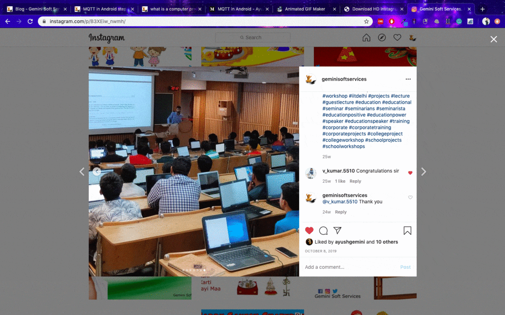

# instagram-image-saver

The objective of this project is to let the user save Instagram images. 
as of now Instagram officially not allowed the user to save the images that's why this project will help you out to save the Instagram images.




## Getting Started

These instructions will get you a copy of the project up and running on your local machine for development and testing purposes.
### Prerequisites

Before running this project you will need given things to be installed on your machine
```
Requests
Beautiful Soup
Flask
```

### Installing the Requirements


To install requests

```
pip install requests
```

To install BeautifulSoup

```
pip install beautifulsoup4
```

To install Flask

```
pip install Flask
```

## Running the tests

for a live demo kindly visit http://ayushgemini.pythonanywhere.com/


